# Kurasu AI — System Architecture

High-level view of how a request travels through the system: a stateless FastAPI backend on
Cloud Run, one shared orchestrator, 8 domain specialists, and a deterministic-services layer
that computes real answers instead of letting the model guess at them.

> Need this as a single image for a slide deck? [`architecture_slide.png`](./architecture_slide.png)
> is the same diagram pre-rendered and ready to paste in as-is.

```mermaid
flowchart TD
    subgraph ROW1[" "]
        direction LR
        UI["📱 <b>CLIENT</b> — mobile-first PWA<br/>React 19 + TypeScript · Vite · Tailwind CSS<br/>Geolocation API · MediaRecorder (voice) · installable"]
        CHAT["⚙️ <b>API LAYER</b> — FastAPI on Cloud Run<br/>POST /api/chat — fully stateless: no server-side session,<br/>every request replays the full conversation from scratch.<br/>Any Cloud Run instance can serve any request."]
        ORCHNODE["🧠 <b>ORCHESTRATION</b> — one generic, shared agent<br/>Gemini structured output (output_schema) decides collecting vs. ready,<br/>driven by declarative RequiredFields per agent — no per-agent orchestrator code"]
        UI -->|"HTTPS · JSON"| CHAT
        CHAT --> ORCHNODE
    end

    subgraph ROW2[" "]
        direction LR
        SPECIALISTS["🎯 <b>8 SPECIALIST AGENTS</b> — Google ADK LlmAgent<br/>🧭 Ask Kurasu · 🏥 Clinic Finder · 🍽️ Restaurant Guide · 🏷️ Ingredient Checker<br/>📦 Delivery Scheduler · 🆘 Disaster Help · 📝 Form Decoder &amp; Filler · 🗑️ Waste Guide"]
        DET["✅ <b>DETERMINISTIC SERVICES</b> — compute first, hand the model verified facts<br/>QR decode (OpenCV) · Haversine shelter distance · Reverse geocoding (Nominatim)<br/>JST clock correction · Browser automation (Playwright) · Form image generation + overlay fallback"]
        EXT["☁️ <b>EXTERNAL INFRASTRUCTURE</b><br/>Vertex AI · Gemini 3.5 Flash &amp; Gemini 3.1 Flash Image · Google Search grounding<br/>Cloud Storage (GSI shelter data) · OpenStreetMap Nominatim · Cloud Text-to-Speech"]
        SPECIALISTS -->|"never guess what code can compute exactly"| DET
        DET --> EXT
    end

    ORCHNODE -->|"hands off the FULL raw conversation,<br/>never a lossy summary, to exactly one match"| SPECIALISTS

    classDef client fill:#EFEAE0,stroke:#8C8471,color:#3D3826,font-size:14px;
    classDef api fill:#E5E7EA,stroke:#5E6773,color:#2B333B,font-size:14px;
    classDef orch fill:#E4E9F0,stroke:#33507D,color:#1E3252,font-size:14px;
    classDef spec fill:#F3E3DA,stroke:#B54A26,color:#7A3115,font-size:14px;
    classDef det fill:#E4E9DE,stroke:#566B4C,color:#33402D,font-size:14px;
    classDef ext fill:#FFFFFF,stroke:#8C8471,color:#3D3826,font-size:14px;
    classDef rowSpacer fill:none,stroke:none;

    class UI client
    class CHAT api
    class ORCHNODE orch
    class SPECIALISTS spec
    class DET det
    class EXT ext
    class ROW1,ROW2 rowSpacer
```

## Layer notes

| Layer | What it is | Why it's built this way |
|---|---|---|
| **Client** | React 19 + TypeScript, Vite, Tailwind CSS, installable PWA | Mobile-first — the target user is often on a phone, mid-errand, sometimes on unreliable connectivity |
| **API layer** | FastAPI on Cloud Run, fully stateless | No server-side session at all — every request replays conversation history and reruns from scratch, so any instance can serve any request. Scales horizontally with zero sticky-session infrastructure. |
| **Orchestration** | One generic orchestrator, reused by all 8 agents | Each agent declares its own `RequiredField`s; the *same* orchestrator code asks for them via Gemini's structured output and decides `collecting` vs. `ready` — adding agent #9 needs zero orchestrator changes |
| **Specialists** | 8 domain-specific `LlmAgent`s (Google ADK) | Each specialist receives the **full raw conversation** on handoff, not a compiled summary — the summarization step was the actual source of repeated, frustrating re-asking in earlier iterations |
| **Deterministic services** | Real Python code: QR decoding, Haversine distance, reverse geocoding, JST time correction, headless-browser automation, image generation | The recurring architectural rule of this app: anything a computer can compute *exactly* (a distance, a decoded QR payload, a ward name from GPS) is computed in code and handed to the model as a verified fact — never left for the LLM to eyeball or guess |
| **External infrastructure** | Vertex AI/Gemini, Google Search grounding, Cloud Storage, Nominatim, Cloud TTS | Managed services the deterministic layer and specialists call out to |

## The 8 specialists at a glance

| Agent | Role |
|---|---|
| 🧭 **Ask Kurasu** | General entry point — answers directly, asks one clarifying question, or recommends another feature |
| 🏥 **Clinic Finder** | Matches symptoms to nearby care that can actually treat them |
| 🍽️ **Restaurant Guide** | Finds food matching cravings or dietary needs |
| 🏷️ **Ingredient Checker** | Reads a label photo against halal/vegan/allergy concerns |
| 📦 **Delivery Scheduler** | The only agent that submits a real request on the user's behalf (Japan Post redelivery, via browser automation) |
| 🆘 **Disaster Help** | Safety-critical — nearest real shelters from Japan government (GSI) open data |
| 📝 **Form Decoder & Filler** | Explains or interviews-and-fills a Japanese form, producing real bilingual completed images |
| 🗑️ **Waste Guide** | Municipality-specific waste-sorting rules via GPS reverse-geocoding |
