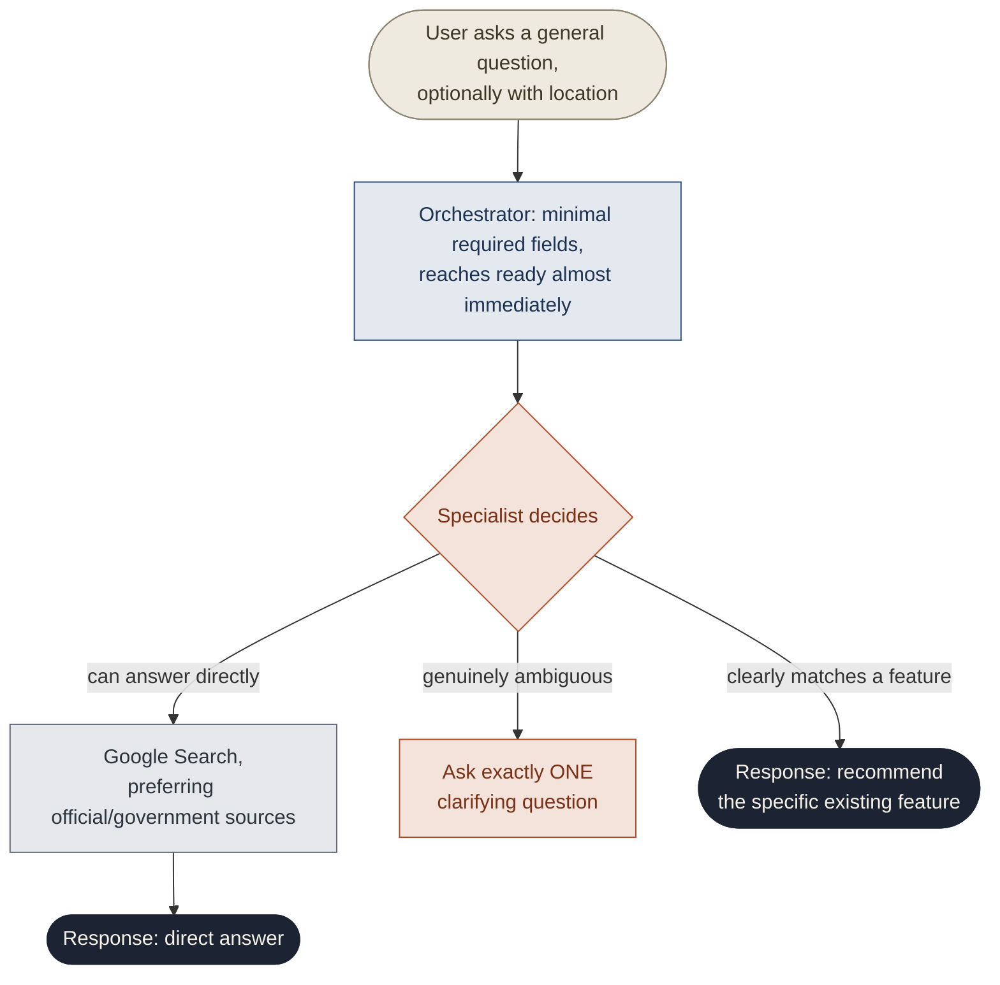
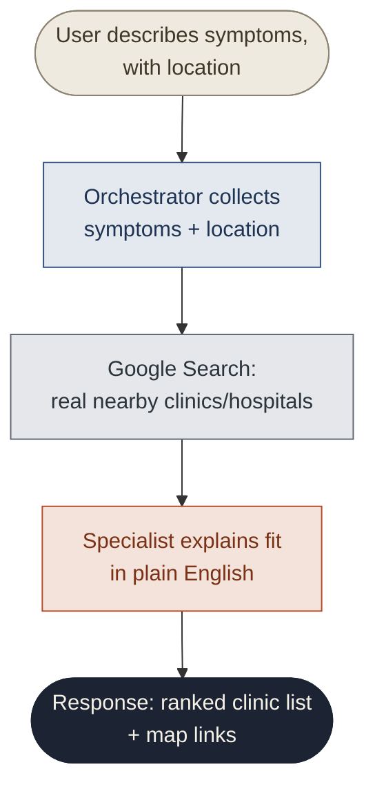
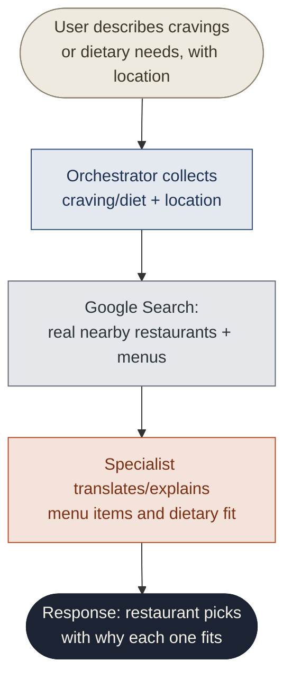
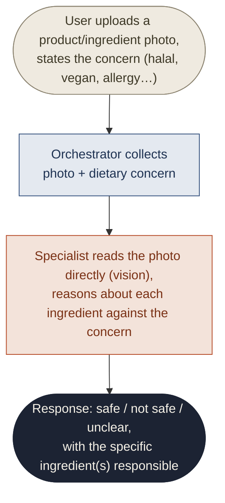
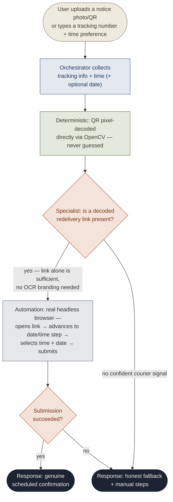
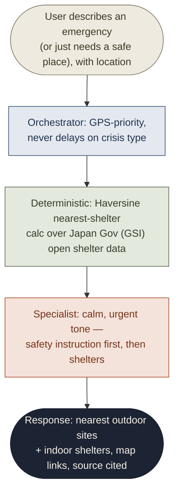
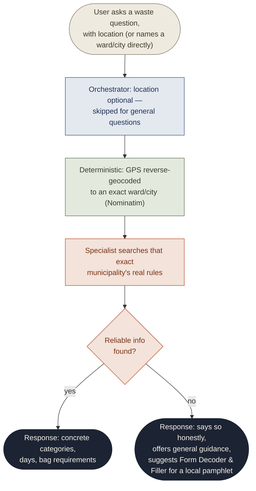
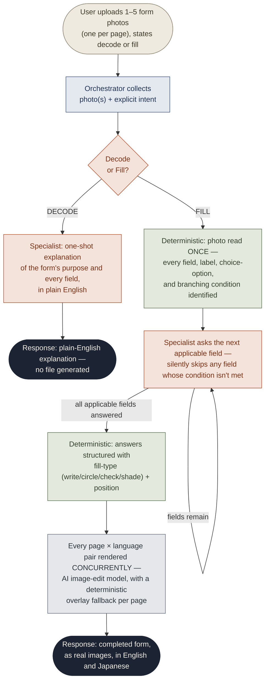

# Kurasu AI — Agent Flow Reference

How a request actually moves through the system for each of the 8 specialist agents, from the
user's first message to the final response. See [`architecture.md`](./architecture.md) for how
these flows sit inside the overall system.

**Legend used across every diagram:**

| Shape / color | Meaning |
|---|---|
| 🟫 Rounded box | User input |
| 🟦 Rectangle | Orchestrator step |
| 🟩 Rectangle | Deterministic / verified compute (never guessed by the model) |
| 🟧 Rectangle | Specialist (LLM) reasoning |
| ⬜ Rectangle | External tool / API call |
| ⬛ Rounded box | Final response |

---

## 🧭 Ask Kurasu

General entry point — the user doesn't need to know which feature fits.

---

## 🏥 Clinic Finder

---

## 🍽️ Restaurant Guide

---

## 🏷️ Ingredient Checker

---

## 📦 Delivery Scheduler

The only feature that submits a real request on the user's behalf.

---

## 🆘 Disaster Help

Safety-critical — minimal friction, government data only.

---

## 🗑️ Waste Guide

Rules are set per municipality, not nationally — location matters.

---

## 📝 Form Decoder & Filler

The most involved flow — branches into two modes after intent is known, and the "fill" branch
is a real back-and-forth interview before two bilingual images are generated.

